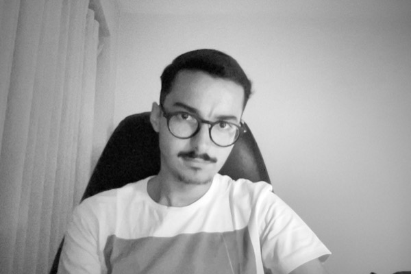

# João Garção

**Humanités Numériques · Technologies du Langage · Analyse de Texte**

[🇵🇹 Português](README.md) · [🇬🇧 English](README.en.md) · [🇫🇷 Français](README.fr.md)

---

Je suis titulaire d'une licence en Langues Appliquées et étudiant en master en Humanités Numériques, tous deux à l'Université du Minho. J'associe linguistique et traduction à la programmation et à la conservation du patrimoine.

## Points forts

- **[Philologie](./projects/digital-humanities/philology)** : transcription d'un manuscrit du XVIIIe siècle et glossaire de figures historiques
- **[TAL](./projects/text-processing/nlp)** : web scraping et analyse textuelle de recettes, en Python
- **[Blog littéraire](https://joo2002vsc.github.io/blog-literario/)** : projet personnel et autodidacte, publié avec GitHub Pages ([code](https://github.com/Joo2002VSC/blog-literario))

## Domaines

| Domaine | Contenu |
|---|---|
| [`digital-humanities`](./projects/digital-humanities) | Philologie, annotation de documents (XML, LaTeX) |
| [`text-processing`](./projects/text-processing) | TAL et analyse de texte |
| [`language-services`](./projects/language-services) | Traduction et traduction automatique |
| [`data-analysis`](./projects/data-analysis) | Analyse et visualisation de données |
| [`web-development`](./projects/web-development) | UX/UI et développement web |

## Langues

Portugais (natif) · Anglais (C2) · Français (B2) · Néerlandais (A2) · Italien (A2)

## CV

[Télécharger mon CV (PDF)](./about/CV-Joao-Garcao.pdf)
