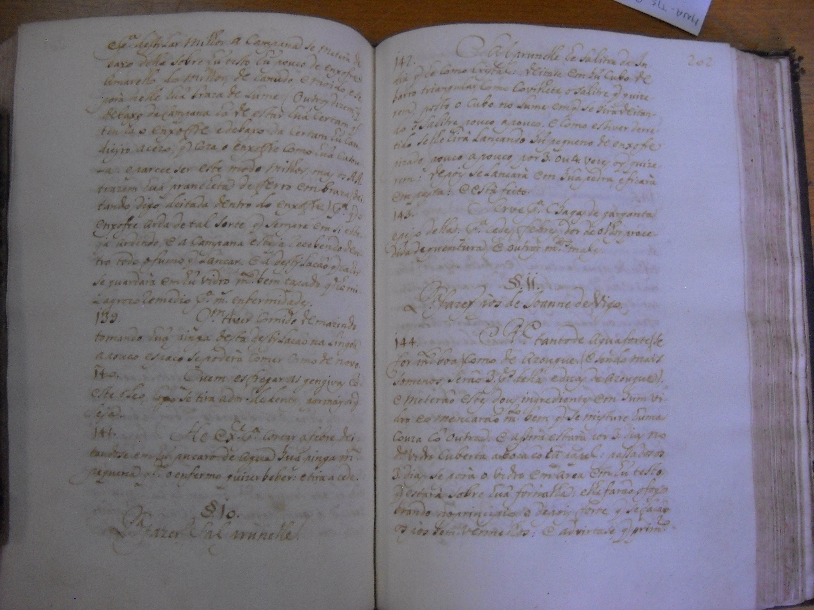

# Filologia · Philology

## 🇵🇹

Trabalho realizado no âmbito da cadeira de **Património Textual** (Mestrado em Humanidades Digitais, Universidade do Minho).

### 📜 Transcrição de manuscrito do séc. XVIII

Transcrição paleográfica de um manuscrito de arquivo (fl. 200v–204), de autoria e título desconhecidos, para português atual.

- **Ficheiro completo:** [`transcricao-facsimile.pdf`](./transcricao-facsimile.pdf)
- **Amostra do facsimilado:**

### 📖 Dicionário de figuras históricas

Glossário elaborado para a mesma cadeira, reunindo figuras históricas mencionadas em fontes de património textual.

- **Ficheiro completo:** [`dicionario-figuras-historicas.pdf`](./dicionario-figuras-historicas.pdf)

---

## 🇬🇧

Work developed for the **Textual Heritage** course (Master's in Digital Humanities, University of Minho).

### 📜 18th-century manuscript transcription

Paleographic transcription of an archival manuscript (fl. 200v–204), of unknown authorship and title, into modern Portuguese.

- **Full file:** [`transcricao-facsimile.pdf`](./transcricao-facsimile.pdf)
- **Facsimile sample:**

### 📖 Dictionary of historical figures

Glossary compiled for the same course, gathering historical figures referenced in textual heritage sources.

- **Full file:** [`dicionario-figuras-historicas.pdf`](./dicionario-figuras-historicas.pdf)
